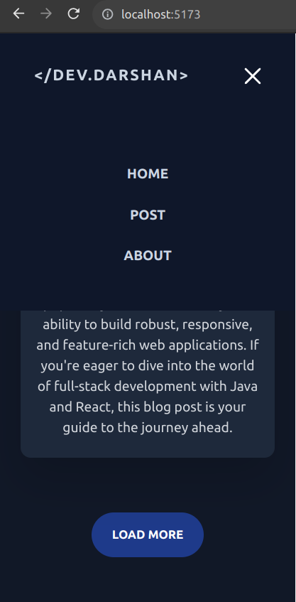
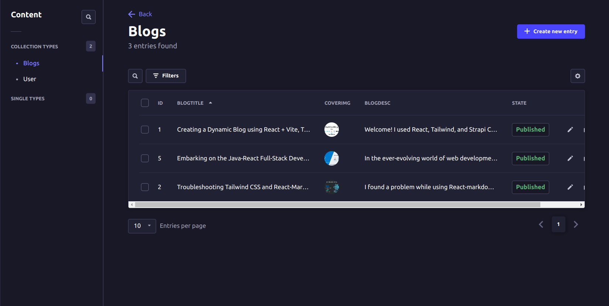

# Blog App with React, Vite, Tailwind CSS, and Strapi CMS

This is a dynamic blog app built using React, Vite, Tailwind CSS, and Strapi CMS. It allows you to create, manage, 
and display blog posts in a beautiful and responsive web application. You can run this app locally and use
it as a starting point for your blogging project.

I haven't deployed it on the web as Strapi CMS is not free for hosting. So not available for preview on web.
But I deployed live blog that used only frontend with same styling. THe live preview of this looks similar to this:
https://blogdarshan.netlify.app/

# Features:

- Create and manage blog posts using Strapi CMS.
- Responsive and visually appealing user interface thanks to Tailwind CSS.
- Fast development with Vite and React.
- Easy to customize and extend.

  # Screenshots
**Home**

**Posts**

**About**

**Mobile**

**Strapi CMS**

